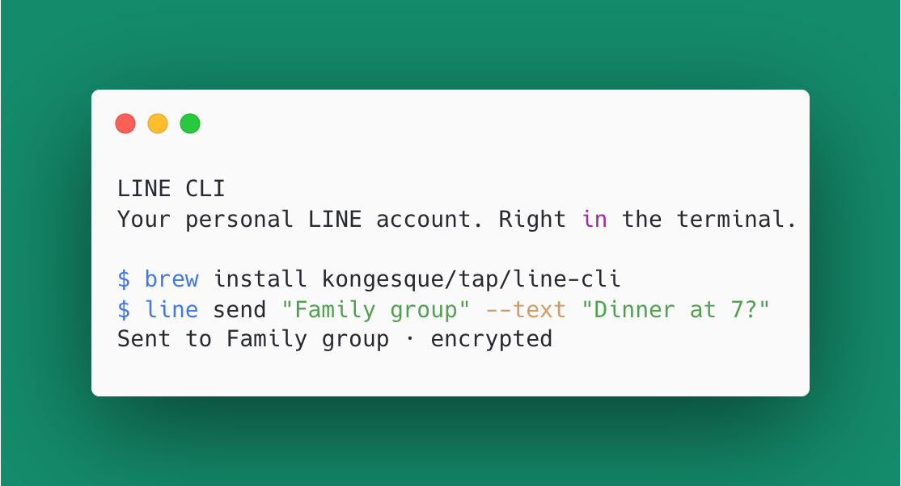

# LINE CLI

LINE CLI is an unofficial command-line client for personal LINE accounts.
Use LINE from your terminal to read and send messages, share files, reply,
react, unsend, watch live events, and automate workflows with JSON.

Unlike LINE Messaging API tools, LINE CLI works with your personal LINE account
rather than a bot account.



[](https://github.com/kongesque/line-cli/actions/workflows/cli.yml)
[](https://github.com/kongesque/line-cli/releases/latest)
[](go.mod)
[](LICENSE)

LINE CLI supports macOS, Linux, and Windows, with Letter Sealing end-to-end
encryption and native credential storage.

> [!IMPORTANT]
> LINE allows one Chrome-style session. Signing in with `line` may replace an
> existing LINE Chrome extension or another Chrome-style client session. The CLI
> stores one account per OS user.

## What it does

- Use your personal LINE account directly from the terminal
- Find contacts, groups, and conversations
- Read recent message history
- Send text and multiline messages
- Send generic files up to 20 MiB
- Reply to existing messages
- Add or remove standard reactions
- Unsend your own messages
- Stream live LINE events as NDJSON
- Produce JSON output for shell scripts and automation
- Protect saved sessions with native OS credential storage
- Use Letter Sealing encryption when supported by the conversation

## Install LINE CLI

### macOS with Homebrew

```sh
brew install kongesque/tap/line-cli
```

Homebrew builds the tagged release from source and installs the `line` command.
This avoids the Gatekeeper warning shown for unsigned browser downloads.

Upgrade later with:

```sh
brew upgrade line-cli
```

### Linux and Windows

Download the archive for your operating system and architecture from
[GitHub Releases](https://github.com/kongesque/line-cli/releases/latest). Verify
the included `SHA256SUMS` before installing `line` or `line.exe`.

Release binaries are currently unsigned. macOS users should prefer Homebrew;
browser-downloaded macOS binaries require manual approval in Privacy & Security.

### Build from source

Building requires Git and Go 1.26 or newer:

```sh
git clone https://github.com/kongesque/line-cli.git
cd line-cli
./install.sh
line help
```

See the [installation guide](CLI.md#build) for Linux keyring requirements,
Windows PowerShell instructions, PATH setup, and manual builds.

## Use LINE from the terminal

Your LINE account needs an email address and password. Login is interactive and
requires approval from your phone.

```sh
line login
line whoami
line chats
line messages "Family group" --limit 10
line send "Alice" --text "Hello!"
```

Names must be unique exact matches when passed as arguments. Run a command
without a target to choose a chat interactively:

```sh
line messages
line send
line react
line unsend
```

Other common actions:

```sh
line send "Alice" --file ./report.pdf
line send "Alice" --text "Sounds good" --reply-to MESSAGE_ID
line react "Alice" --message MESSAGE_ID --reaction love
line download "Alice" --message MESSAGE_ID --output ./received.pdf
```

Use `line COMMAND --help` for flags and examples.

## JSON and automation

```sh
line chats --search "Family" --json
line messages "Alice" --limit 20 --json
line send "Alice" --stdin < message.txt
line watch --json > events.ndjson
```

JSON data goes to stdout and diagnostics go to stderr. Treat exported messages
and events as private conversation data.

Remote mutations are attempted once and are never retried automatically. If a
send or upload loses its response, inspect LINE before trying again to avoid a
duplicate.

## Security and privacy

LINE CLI uses Letter Sealing when the account and conversation support it.
Missing keys and network failures do not silently downgrade an encrypted send to
plaintext. Send results report whether encryption was used.

Your password is never saved. Sessions are protected by the operating system:

| Platform | Credential storage |
| --- | --- |
| macOS | Keychain |
| Linux | AES-GCM session file with its wrapping key in Secret Service |
| Windows | Current-user DPAPI |

LINE CLI is built on LINE's Chrome-style protocol. Server-side changes can affect
compatibility.

## Current limitations

- One saved account per OS user
- Recent history only, up to 100 messages per read
- Generic file transfer only; no stickers or specialized media messages
- Reading messages does not mark them as read
- Some protocol paths still need broader live validation

## Documentation

- [Complete CLI reference and troubleshooting](CLI.md)
- [Letter Sealing implementation notes](readme/LETTER_SEALING.md)
- [Contributor guidance and package layout](AGENTS.md)

## Development

```sh
./build.sh
go test -race ./internal/... ./cmd/line ./pkg/line/... ./pkg/e2ee
go vet ./internal/... ./cmd/line ./pkg/line ./pkg/e2ee ./pkg
```

CI runs on Linux, macOS, and Windows, including native credential-store checks.

## License and provenance

LINE CLI is not affiliated with or endorsed by LINE. It is derived from
[beeper/line](https://github.com/beeper/line); shared protocol and crypto code
retain their upstream copyright and provenance. The Matrix connector and Beeper
deployment stack are not part of this project.

Distributed under the [MIT License](LICENSE).
