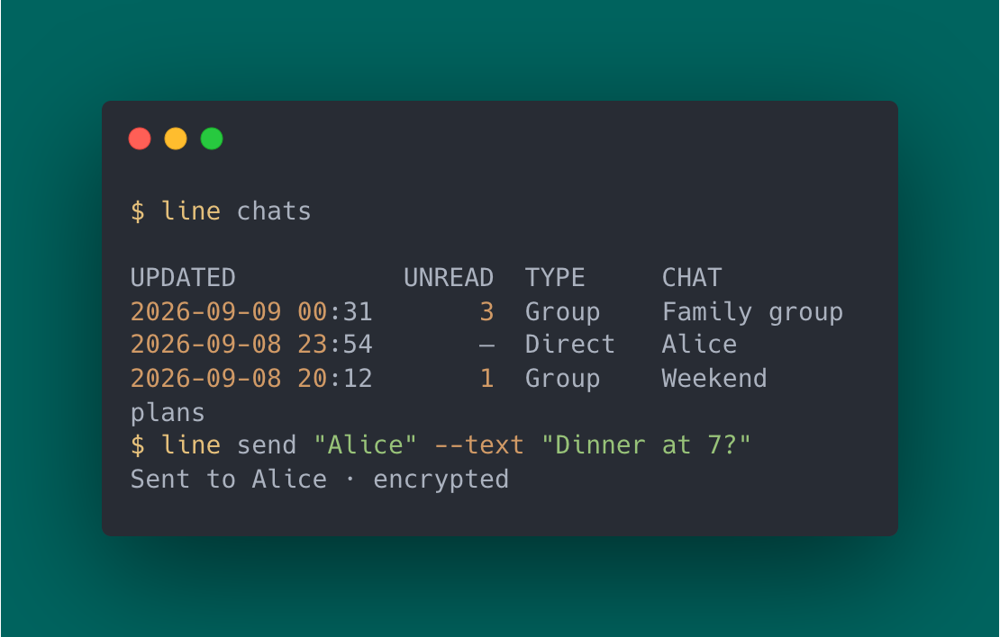

# LINE CLI：個人 LINE 帳號的指令列用戶端

[English](README.md) | 繁體中文（台灣）  | [日本語](README.ja.md) | [ภาษาไทย](README.th.md)

**LINE CLI** 是以 Go 撰寫的非官方開源 LINE 指令列用戶端。
你可以在終端機傳送 LINE 訊息、讀取個人與群組聊天室、分享檔案、下載附件，
並串流接收即時事件。日常傳訊可使用互動式提示，也能透過 JSON 輸出串接
shell 指令稿與 AI 代理程式工作流程。

支援 **macOS、Linux 與 Windows**，並在聊天室支援時使用 Letter Sealing
端對端加密。使用你的個人 LINE 帳號登入即可，不需要機器人帳號或設定
LINE Messaging API。

[](https://github.com/kongesque/line-cli/actions/workflows/cli.yml)
[](https://github.com/kongesque/line-cli/releases/latest)
[](go.mod)
[](LICENSE)

[安裝](#install-line-cli) · [快速上手](#quick-start-send-your-first-line-message) · [指令](#line-messaging-commands) · [自動化](#automate-line-with-json-and-shell-scripts) · [完整指南](docs/CLI.zh-TW.md)



<a id="install-line-cli"></a>

## 安裝 LINE CLI

### macOS：Homebrew

```sh
brew install kongesque/tap/line-cli
```

### macOS 與 Linux：獨立執行檔安裝程式

```sh
curl --proto '=https' --tlsv1.2 -fsSL https://raw.githubusercontent.com/kongesque/line-cli/main/scripts/install-release.sh | sh
```

安裝程式會偵測作業系統與 CPU 架構、驗證發行檔的檢查碼，並將 `line`
安裝至 `~/.local/bin`。若提示需要套用 `PATH` 設定，請重新開啟終端機。

**Linux 桌面：** 登入前，請確認 Secret Service 金鑰圈已啟動並解鎖，
且與 `line` 位於同一個 D-Bus 工作階段。Debian／Ubuntu 可安裝以下工具：

```sh
sudo apt install libsecret-tools gnome-keyring
```

**Linux 伺服器或 SSH：** 只安裝套件還不夠。在支援的主機上，
`line login --headless` 可使用主機金鑰儲存，不需要已解鎖的金鑰圈。
首次設定仍需互動式操作；此儲存方式無法防止整顆磁碟遭複製，也不提供 TPM 保護。
詳見[無頭環境設定、移轉與服務部署](docs/CLI.zh-TW.md#linux-servers-and-headless-storage)。

### Windows：PowerShell

```powershell
irm https://raw.githubusercontent.com/kongesque/line-cli/main/scripts/install-release.ps1 | iex
```

安裝程式會驗證檢查碼，並將 `line.exe` 加入使用者的 `PATH`。
必要時請重新開啟 PowerShell。Windows 不需要額外安裝金鑰圈套件。

你也可以[下載發行檔](https://github.com/kongesque/line-cli/releases/latest)
或[從原始碼建置](#build-and-contribute)。發行檔尚未經過數位簽署或公證。

確認安裝結果：

```sh
line version
line help
```

<a id="quick-start-send-your-first-line-message"></a>

## 快速上手：傳送第一則 LINE 訊息

> [!IMPORTANT]
> 登入可能會取代現有的 LINE Chrome 擴充功能或其他 Chrome 類型用戶端工作階段。
> LINE CLI 會為每位作業系統使用者儲存一個帳號。

### 1. 使用手機上的 LINE 登入

```sh
line login
```

使用手機 LINE 的掃描器掃描終端機上的 QR 碼、核准登入，並依提示輸入顯示的 PIN。
請等到出現 **Session saved securely**。QR 碼登入目前為實驗性功能，
且必須啟用 Letter Sealing。

如果你的帳號已設定電子郵件與密碼，也可以使用：

```sh
line login --email you@example.com
```

輸入密碼時不會顯示內容，也不會儲存密碼。登入會檢查儲存機制，並在取代可用的
已儲存工作階段前詢問。
詳見[登入選項與 QR 碼疑難排解](docs/CLI.zh-TW.md#login-options-and-qr-help)。

### 2. 瀏覽聊天室並傳送訊息

```sh
line whoami     # 確認目前帳號
line chats      # 列出聊天室
line messages   # 選擇聊天室並讀取近期訊息
line send       # 選擇收件人並輸入訊息
```

在互動式終端機中，CLI 會提示你補齊所需資料。按 Ctrl-C 可取消，
也能像以下範例一樣直接指定聊天室名稱。

<a id="line-messaging-commands"></a>

## LINE 訊息操作指令

| 想做什麼 | 指令 |
| --- | --- |
| 尋找好友 | `line contacts --search "Alice"` |
| 以使用者 ID 查詢個人資料 | `line contacts --mid USER_MID` |
| 尋找聊天室與群組 | `line chats --search "Family"` |
| 讀取近期訊息 | `line messages "Alice" --limit 20` |
| 傳送文字訊息 | `line send "Alice" --text "Hello!"` |
| 傳送檔案 | `line send "Alice" --file ./report.pdf` |
| 下載照片、影片、音訊或檔案 | `line download` |
| 新增或移除表情回應 | `line react` |
| 收回自己傳送的訊息 | `line unsend` |
| 串流接收即時事件 | `line watch` |
| 檢查本機工作階段儲存機制 | `line auth status --check` |
| 移除本機已儲存的工作階段 | `line logout` |

請將範例名稱換成自己的聯絡人或聊天室名稱。名稱必須唯一且完全相符
（不區分大小寫）；含空格的名稱請加上引號。若名稱重複，可使用
`line chats --search "Alice" --show-ids` 查詢，再指定完整的聊天室 ID。

使用 `line COMMAND --help` 查看選項。下載、表情回應與收回訊息也支援互動式選擇。
詳見[聊天室選擇指南](docs/CLI.zh-TW.md#find-chats-and-people)。

### 回覆 LINE 訊息與下載附件

使用 `--show-ids` 找出 ID，再替換範例中的 `MESSAGE_ID`：

```sh
line messages "Alice" --show-ids
line send "Alice" --text "Sounds good" --reply-to MESSAGE_ID
line react "Alice" --message MESSAGE_ID --reaction love
line download "Alice" --message MESSAGE_ID --output ./received.pdf
```

下載時，請選擇附件訊息的 ID，並指定合適的檔名。既有檔案不會被覆寫。
詳見[更多表情回應、收回訊息與下載選項](docs/CLI.zh-TW.md#download-or-change-a-message)。

<a id="automate-line-with-json-and-shell-scripts"></a>

## 使用 JSON 與 shell 指令稿自動化 LINE

加入 `--json` 可將結構化資料輸出至 stdout；診斷訊息則輸出至 stderr。
`--json` 與 `--stdin` 會停用互動式提示，請提供所有必要參數。
名稱可能變動，因此指令稿應使用完整的聊天室 ID。

```sh
line chats --search "Family" --json
line messages CHAT_ID --limit 20 --json
line send CHAT_ID --stdin --json < message.txt
line watch --json > events.ndjson
```

從 `line chats --json` 取得 `CHAT_ID`。`--stdin` 可從檔案或管線讀取多行文字。
`watch` 會輸出每行一筆 JSON 的 NDJSON，並從已儲存的檢查點繼續；
接收端應依 revision 去除重複事件。請將匯出的訊息與事件視為私人資料。

會變更遠端資料的操作只會嘗試一次，不會自動重試。如果傳送訊息、上傳、
表情回應或收回訊息後未收到回應，請先在 LINE 中確認結果，再決定是否重做，
以免重複操作。

串接細節請參閱 [JSON 欄位與結束代碼](docs/CLI.zh-TW.md#json-output-and-exit-codes)
及[即時事件串流](docs/CLI.zh-TW.md#watch-new-events)。

## Letter Sealing 加密與工作階段安全性

- **加密：** 支援時會使用 Letter Sealing。金鑰缺少、格式錯誤或傳輸失敗時，
  原應加密的訊息不會在未告知的情況下改以明文傳送。JSON 傳送結果會顯示加密狀態。
- **儲存：** macOS 使用 Keychain；Linux 使用 AES-GCM 加密的工作階段檔案，
  金鑰存放於 Secret Service；Windows 使用目前使用者的 DPAPI。
  無頭 Linux 使用主機金鑰儲存。
- **工作階段復原：** 已儲存的更新憑證有效時，存取權杖會自動更新，重新啟動後也適用。
  若更新無法恢復存取，或 LINE 使工作階段失效，請重新登入。

[工作階段儲存](docs/CLI.zh-TW.md#where-your-session-is-stored) ·
[權杖更新與復原](docs/CLI.zh-TW.md#token-refresh)

## 使用限制

- 僅能讀取近期訊息，每次最多 100 則。讀取不會將訊息標為已讀；
  部分較舊的加密訊息可能無法讀取。
- 檔案傳送與媒體下載上限為 20 MiB。以 `--file` 傳送的圖片、影片與音訊
  會顯示為一般檔案；不支援貼圖或專用媒體訊息傳送，也無法下載外部媒體 URL。
- LINE CLI 使用 LINE 的 Chrome 類型協定。伺服器變更可能影響相容性，
  部分協定流程仍需要更廣泛的實際環境驗證。

## 更新 LINE CLI

升級前，請先停止正在執行的指令與事件監看程序；不支援新舊版本同時執行。

```sh
line update --check   # 檢查最新版本，不進行安裝
line update           # 支援時更新，否則顯示升級指引
```

macOS 與 Linux 的官方獨立執行檔安裝可直接更新。Homebrew 請使用
`brew upgrade line-cli`；其他安裝方式會收到升級指引。檢查更新不需要登入 LINE，
且只在你執行指令時進行。詳見[更新說明](docs/CLI.zh-TW.md#updating-line-cli)。

## 文件與協助

- [CLI 指南](docs/CLI.zh-TW.md)：完整用法、疑難排解與伺服器設定。
- [權杖與工作階段稽核](TOKEN_SESSION.md)：更新與復原的實作細節。
- [GitHub Issues](https://github.com/kongesque/line-cli/issues)：回報錯誤或提出功能需求。

回報錯誤時，請附上 `line version`、作業系統、指令及已遮蔽敏感內容的錯誤訊息。
請勿提供密碼、權杖、QR 碼登入值或私人訊息。

<a id="build-and-contribute"></a>

## 建置與參與開發

從原始碼建置需要 Git 與 **Go 1.26+**。macOS 另需 Xcode Command Line Tools
及 CGO，以支援 Keychain。在 macOS 或 Linux 上執行：

```sh
git clone https://github.com/kongesque/line-cli.git
cd line-cli
./install.sh
```

請依安裝程式提示設定 PATH。Windows PowerShell 指令請參閱
[原始碼建置指南](docs/CLI.zh-TW.md#build-from-source)。Linux 的儲存需求同樣適用於原始碼建置。

本機開發：

```sh
./build.sh
./bin/line help
go test -race ./internal/... ./cmd/line ./pkg/line/... ./pkg/e2ee
go vet ./internal/... ./cmd/line ./pkg/line ./pkg/e2ee ./pkg
```

完整檢查與協定要求請參閱[貢獻者指南](AGENTS.md)。CI 涵蓋三種平台與原生認證資料儲存。
測試使用合成資料與模擬 API；實際 LINE 測試需要明確授權。

## 授權與來源

LINE CLI 與 LINE 無關，也未獲 LINE 背書。本專案衍生自
[beeper/line](https://github.com/beeper/line)；共用的協定與加密程式碼保留
上游著作權聲明與來源資訊。Matrix 連接器與 Beeper 部署環境不包含在本專案中。

以 [MIT 授權條款](LICENSE)發布。
